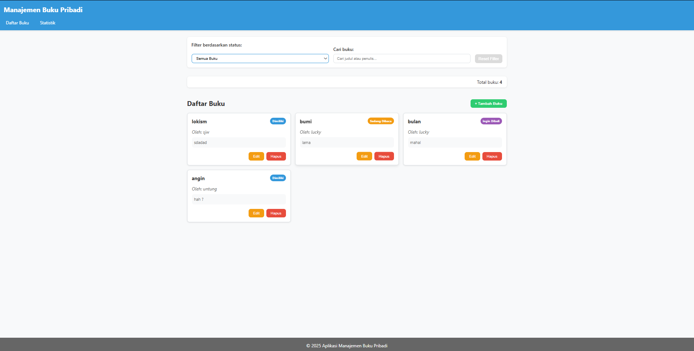
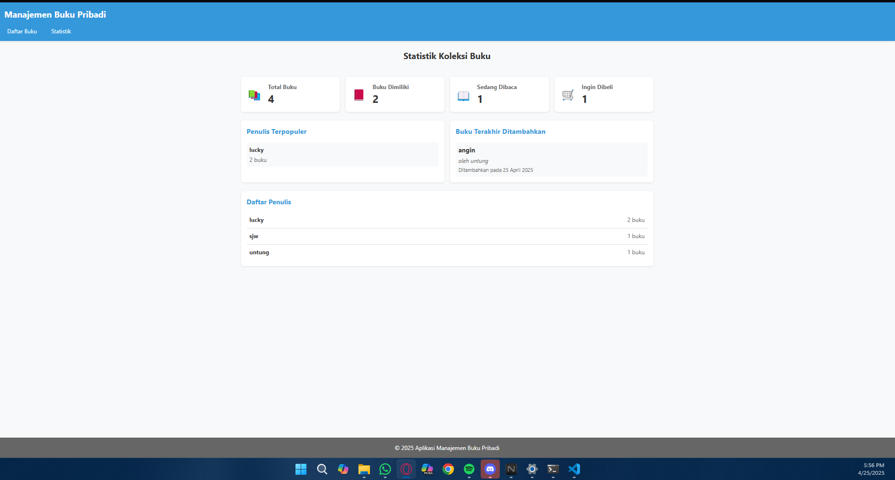
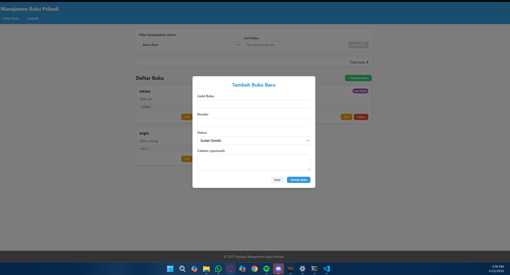
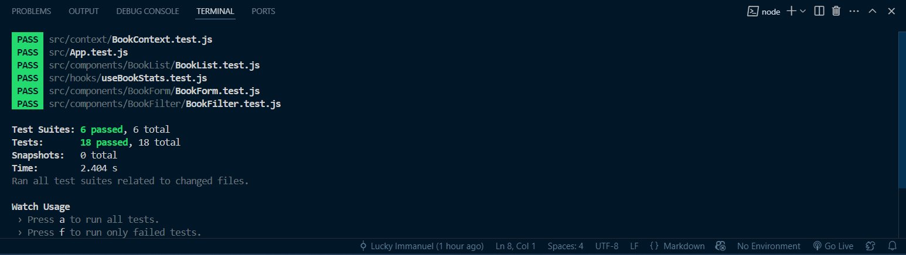

1. Screenshoot web

2. Screenshoot test

Aplikasi Manajemen Buku Pribadi adalah aplikasi web yang memungkinkan pengguna untuk mencatat, mengelola, dan melacak buku-buku yang mereka miliki, sedang dibaca, atau ingin dibeli. Aplikasi ini dibangun menggunakan React dan memanfaatkan fitur-fitur modern seperti Hooks, Context API, dan React Router.
Fitur Utama

Manajemen Buku:

Tambah buku baru dengan judul, penulis, status (milik/baca/beli), dan catatan
Edit informasi buku yang sudah ada
Hapus buku dari koleksi

Pengorganisasian:

Filter buku berdasarkan status (milik, sedang dibaca, ingin dibeli)
Pencarian buku berdasarkan judul atau penulis
Tampilan statistik koleksi buku

Penyimpanan Data Lokal:

Data buku disimpan di localStorage, sehingga tetap tersedia setelah page refresh

Teknologi yang Digunakan
React

Functional Components dengan Hooks (useState, useEffect, useReducer, useContext)
Context API untuk manajemen state global
React Router untuk navigasi multi-halaman

Custom Hooks

useLocalStorage: Hook untuk menyimpan dan mengambil data dari localStorage
useBookStats: Hook untuk menghitung statistik dari daftar buku

Pengujian

React Testing Library untuk unit testing komponen dan logika aplikasi
Jest sebagai test runner

Validasi

PropTypes untuk type checking komponen

Instalasi dan Menjalankan Aplikasi

Prasyarat:

Node.js (versi 14 atau lebih baru)
npm atau yarn

Langkah Instalasi:

npx create-react-app lucky_122140179_pertemuan3
cd lucky_122140179_pertemuan3

# Install dependensi tambahan
npm install react-router-dom prop-types 

# instalansi untuk testing
npm install --save-dev @testing-library/react-hooks

# Jalankan aplikasi dalam mode pengembangan
npm start
