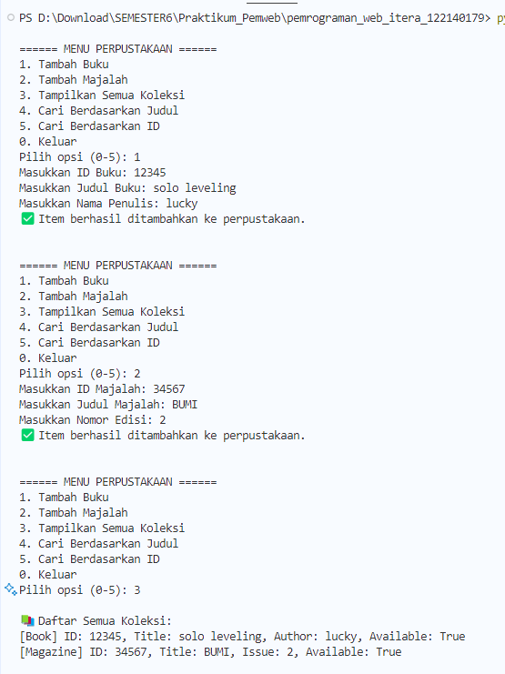
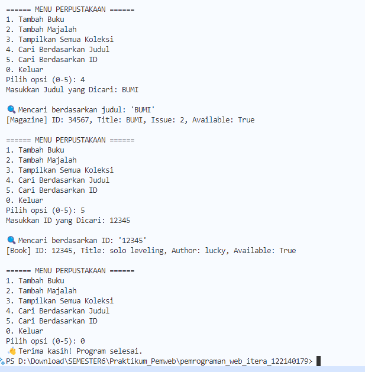

1. Screenshoot hasil

Sistem Manajemen Perpustakaan Sederhana (Python OOP)
Sistem ini dibuat menggunakan konsep Object-Oriented Programming (OOP) dalam Python untuk mengelola koleksi item di perpustakaan, seperti buku dan majalah.

# Fitur Utama
Menambahkan Buku dan Majalah ke dalam koleksi

Menampilkan semua koleksi perpustakaan

Mencari koleksi berdasarkan judul

Mencari koleksi berdasarkan ID

Menampilkan informasi detail setiap item

Penggunaan abstract class, encapsulation, dan property

# Struktur Kelas
1. LibraryItem (Abstract Class)
Dasar dari semua item perpustakaan, memiliki atribut:

_item_id

_title

_available

Method:

display_info() (abstract)

check_availability()

set_availability(status)

Getter: item_id, title

2. Book (Subclass of LibraryItem)
Menambahkan atribut khusus:

__author

Mengimplementasikan:

display_info() untuk menampilkan informasi buku.

3. Magazine (Subclass of LibraryItem)
Menambahkan atribut khusus:

__issue_number

Mengimplementasikan:

display_info() untuk menampilkan informasi majalah.

4. Library
Kelas manajemen koleksi item perpustakaan:

__items (list dari LibraryItem)

add_item(item)

display_all_items()

search_by_title(title)

search_by_id(item_id)

# Cara Menjalankan Program
Pastikan Python 3 telah terinstal.

Simpan file sebagai library_system.py

Jalankan dengan:

bash
Copy
Edit
python library_system.py
Ikuti menu interaktif untuk menambahkan/mencari koleksi.

# Konsep Pemrograman yang Digunakan
Abstraction: Melalui kelas LibraryItem yang abstrak.

Inheritance: Kelas Book dan Magazine mewarisi dari LibraryItem.

Encapsulation: Penggunaan _ dan __ untuk melindungi atribut.

Polymorphism: Method display_info() diimplementasi berbeda pada Book dan Magazine.

Property: Akses aman atribut melalui @property.

# Output
====== MENU PERPUSTAKAAN ======
1. Tambah Buku
2. Tambah Majalah
3. Tampilkan Semua Koleksi
4. Cari Berdasarkan Judul
5. Cari Berdasarkan ID
0. Keluar
Pilih opsi (0-5):
